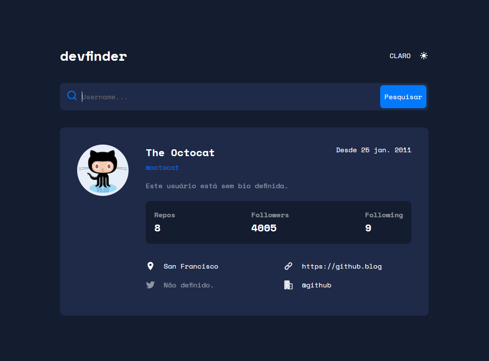

<h1 align="center">
 
  
 
 
</h1>

O dev-finder é uma interface para a api do github, trazendo informações básicas sobre o usuário.

  

[//]: # (Add your gifs/images here:)

  

## Features
[//]: # (Add the features of your project here:)

- ⚛️ **React Js** — Uma biblioteca Javascript para construção de interface de usuário.
- 💅 **Sass** - Sass é uma linguagem de folha de estilo compilada para CSS. Ela permite que você use variáveis , regras aninhadas , mixins , funções e muito mais.
- 🌐 **Axios** - É um cliente HTTP baseado em Promises para fazer requisições. Pode ser utilizado tanto no navegador quanto no Node. js.

## Iniciando

1. Clone este repositório usando `git clone git@github.com:Salv-Dev/dev-finder.git`
2. Vá para o diretório: `cd dev-finder` 
### Iniciando o frontend

1. Rode `npm i` para instalar as dependências.
2. e Rode `npm start` para iniciar a aplicação.

## License

This project is licensed under the MIT License - see the [LICENSE](https://opensource.org/licenses/MIT) page for details.
